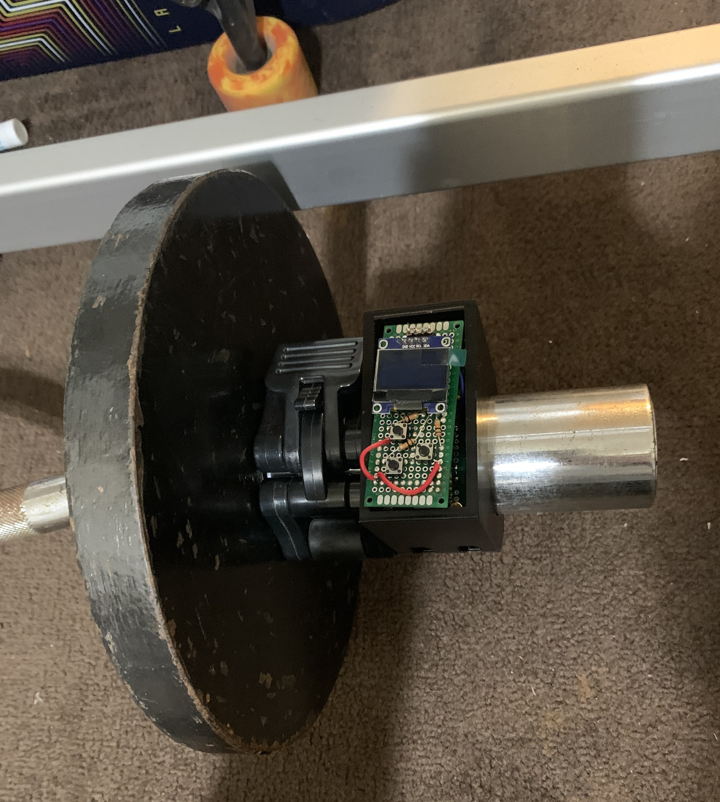

# Smart Clamp

A smart clamp that automatically records workout data like the number of repetitions and time under tension while lifting weights.

## Inspiration

We wanted to build something that utilized IoT/Robotics since we are passionate about that and we wanted to build something that we could use in our daily lives.

## What it does

The Smart Clamp is a clamp that can be attached to any barbell or dumbbell. It can record the weight, the number of reps, and the time of the workout. The data is then uploaded to a database where it can be viewed on a website. The website has a leaderboard that shows the top 10 users in that exercise and the user's workout data.

## How we built it

The Smart Clamp is built using a Raspberry Pi Pico W on MicroPython. We used an MPU6050 for measuring acceleration data for calculating the number of reps the user performs in their set. We use an OLED screen to allow the user to choose which exercise they would like to perform and set the weight they are using. We use a 3D printed clamp to attach the Smart Clamp to the barbell or dumbbell. The Smart Clamp is powered by a LiPo battery. We use 3 buttons to allow the user to navigate the OLED screen. The Smart Clamp is connected to the internet using a WiFi module.

The website is built using Typescript, ReactJs, and Express. The website is hosted on AWS S3 and has CICD setup using GitHub Actions. The website uses a RESTful backend API to communicate with the database. The database is MySQL and is hosted on AWS RDS. The backend server is hosted on an AWS EC2 instance.

### System Design

### Implementation

## Challenges we ran into

We ran into a lot of problems with our IMU device. Originally we had one picked out but the open source drivers available were way too large for the Pico W. So we opted for a much older IMU, the MPU6050 that was much easier to work with. We had a lot of trouble with the OLED and getting it to update the screen properly. We also had trouble sending the correct data to the database. We had to do a lot of debugging to get everything working properly because sometimes the hardware would just stop and start working randomly it seemed.

## Accomplishments that we're proud of

We are pretty proud of how everything came together. From the custom hardware to the clean website and how everything works together. We were really proud of our custom OLED interface that we built using only 3 buttons.

## What we learned

We learned that Raspberry Pico W libraries in python are very bloated and not really ideal for most embedded projects.

## What's next for Smart Clamp

We would like to recreate the project using smart watches since we believe it could perform this task more seamlessly.

## Built With

- Python
- TypeScript
- Node.js
- MicroPython
- Raspberry Pi Pico W
- MySQL
- ReactJS
- ExpressJS
- AWS RDS
- AWS S3
- AWS EC2
- GitHub
- GitHub Actions
- SolidWorks

## Screenshot of Website

### Additional Links

- [Plan of Reference (POR) Link](https://docs.google.com/presentation/d/1PxHl6Sy7KdKY_HC14jw1VjQoOGeRQi7q73b3B5r9FrE/edit?usp=sharing)

- [DevPost Link](https://devpost.com/software/smart-clamp)
